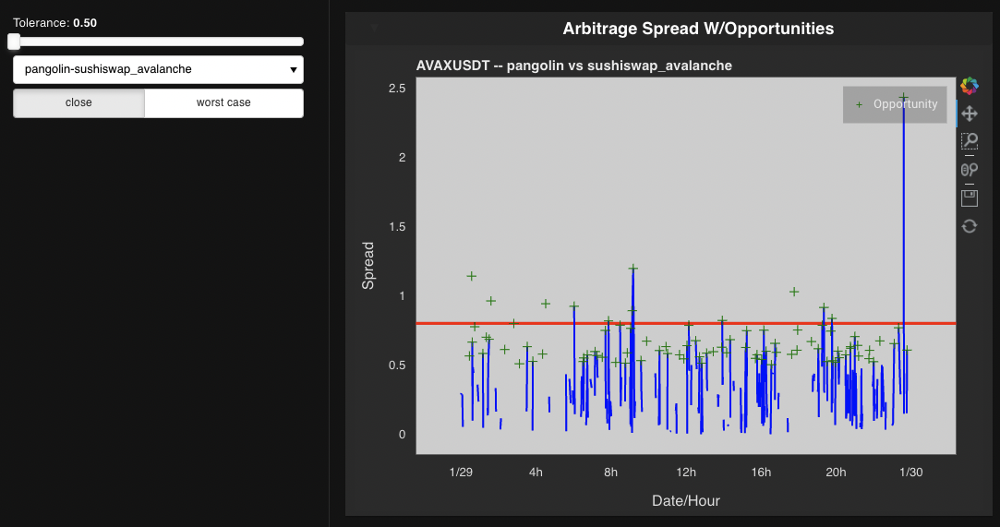

# Fintech Project 1 -- Arbitrage Opportunities On Decentralized Exchanges

### Project Overview

Command-line application which can dynamically fetch, analyze and chart multiple blockchains and markets for arbitrage oportunities for liquidity pairs between different exhanges. For example, the [Binance chain](https://www.binance.org/en/smartChain), looking at `BNBBUSD` on [ApeSwap](https://apeswap.finance/) and [PancakeSwap](https://pancakeswap.finance/swap).  

[Presentation slides](/media/Presentation.pdf)  

See [installation guide](#installation-guide) below for specifics on setting up your environment.

---

## Technologies And Modules

This proect uses [python 3.7](https://docs.python.org/3.7/) and the following modules:


[Built-in](https://docs.python.org/3/py-modindex.html) modules:  
- [csv](https://docs.python.org/3/library/csv.html#module-csv)
- [pathlib](https://docs.python.org/3/library/pathlib.html#module-pathlib)
- [time](https://docs.python.org/3.7/library/time.html?highlight=time#module-time)
- [datetime](https://docs.python.org/3.7/library/datetime.html#module-datetime)
- [itertools](https://docs.python.org/3.7/library/itertools.html?highlight=itertools)
- [re](https://docs.python.org/3.7/library/re.html?highlight=re#module-re)

From [pip](https://pypi.org/):  
- [fire](https://pypi.org/project/fire/)
- [questionary](https://pypi.org/project/questionary/)
- [pandas](https://pypi.org/project/pandas/)
- [numpy](https://pypi.org/project/numpy/)
- [hvplot](https://pypi.org/project/hvplot/)
- [panel](https://pypi.org/project/panel/)
- [holoviews](https://pypi.org/project/holoviews/)
- [requests](https://pypi.org/project/requests/)
- [questionary](https://github.com/tmbo/questionary)

Self-authored:  
- [dextrader.nomics.pairs](src/dextrader/nomics/pairs.py) Market/pair config data
- [dextrader.nomics.utils](src/dextrader/nomics/utils.py) Nomics API utilities
- [analysis.py](src/analysis.py) Analysis functionality
- [visuals.py](src/visuals.py) Visualization funcationality

Main CLI Application
- [client.py](src/visuals.py)


See [installation guide](#installation-guide) below for specifics on setting up your environment.

---


## Installation Guide

:warning: **If you wish to pull real-time data via the nomics api, you will need your own nomics api-key**: Put your key in a file called APIKEYS.py in `/src` with `API_KEY = "{YOUR_KEY}"` inside. Also, search for `NOMICS-API uncomment` in `client.py` and uncomment the line below to use the API key. :warning:


You will need Python 3.7 for this application to run. An easy way to install python 3.7 is to download and install [Anaconda](https://www.anaconda.com/products/individual). After installing anaconda, open a terminal/command-prompt, and setup a python 3.7 environment, and then activate it like so:

```
# creating a python 3.7 environment
# name can be any friendly name to refer to your environment, eg 'dev'
conda create --name dev python=3.7 anaconda

# activating the environment
conda activate dev
```

Next, use [pip](https://pypi.org/project/pip/) to install the required modules from the [list above](#Technologies-And-Modules)


```
# instaling required modules
$ pip install fire
$ pip install questionary
$ etc...
```
You are now ready to run the program!

---

## Usage

First, ensure you've cloned this repo and setup your environment as detailed in the [Installation Guide](#installation-guide)

### Main application
Next, open a terminal and cd to the `src` directory. You will run the `client.py` file, and follow the prompts to:  
- choose a chain
- choose a pair to analyze
- choose to update (re)fresh data
- run analysis
- run vizualizations

The final screen output will be both a text-based summary of the arbitrage.


```
# running the application
cd <path_to_repo>/src/
# launch the app and follow the cli
python client.py
```


#### Unit tests
You can ensure your setup is working by running any of the _tests.py files from within src.

#### Nomics API module
```python
from dextrader.nomics.utils import get_candles, format_query_as_dataframe, get_recent_trades
```
Nomics utils has the functions for scraping nomics data via their api, please see the nomics_test.py file for examples.


#### Known Issues  
There is a bug where if you try and re-use old-csv data from before today, the filter may not pick it up and you will get an empty analysis or crash. If so, just be sure to refresh data for your selected pair, and re-run. If you have existing csv data from earlier today, everything will work. Will be fixed in next version.  


---


## Analysis Summary

### Assumptions
Nomics candle data for 1 minute intervals was used for a 24 hr period to simplify the arbitrage analysis between two markets.

Both an optimistic analysis, using the closed prices for each candle minute, as well as a more conservative / worst-case analysis that was done to try and increase the likelihood of having a profitable arbitrage trade opportunity. [Examples below](#summary)

Any new chains, markets, pairs can be entered into the [pairs](src/dextrader/nomics/pairs.py) config module and will be dynamically fetched based on user choice with the application.


### Summary

The arbitrage tool is able to update and analyze market pair data across multiple exchanges on a given chain. For each selected pair, the arbitrage opportunities are calculated across the combinations of all exchanges available. Then, both a textual summary and a set of three plots, an interactive `Arbitrage Spread`, a `1-min Candle`, and `Trade Volume` views are presented to the user.  

Below is an example of the summary and three plots, for an analysis on the `Avalanche` chain for `AVAXUSDT` pair. You can see that each exchange pair indeed yeilds different levels of arbitrage potential.  


| Chain / Pair | Exchanges | Profitable Opportunties (worst case) | Profitable Opportunties (closing prices) |
| :---       |    :---:    | :---:   | :---:   |
| Avalanche / AVAXUSDT |  pangolin v  sushiswap_avalanche  | 7 |  12 |
| Avalanche / AVAXUSDT |  pangolin v traderjoe   | 0 |  5 |
| Avalanche / AVAXUSDT |  sushiswap v traderjoe   | 3 |  23 |  


`Profitable Trades Summary (textual): AVAXUSDT Summary (Pangolin v Sushiswap)`  
  

`Spread Plot -- (note opportunities above red threshold line)`  
  

`1-min Candle View`  
  

`Trade Volume View`  


---


## Contributors

[Peter Morales](https://github.com/pmm09c)  
[Shivangi Gupta](https://github.com/shivangiuw)   
[Jaime Aranda](https://github.com/Aranda80)  
[David Lopez](https://github.com/sububer)  

---

## License

MIT
